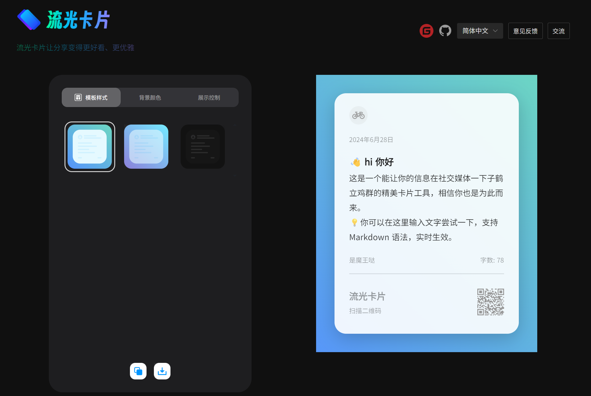
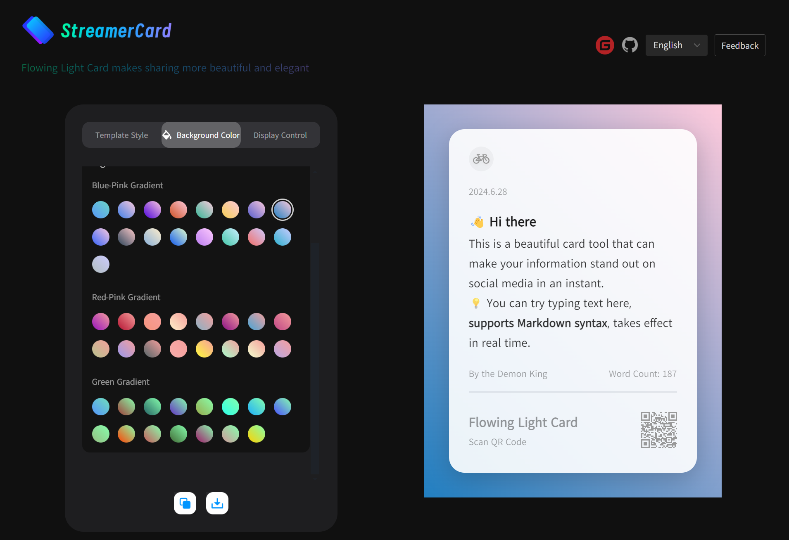
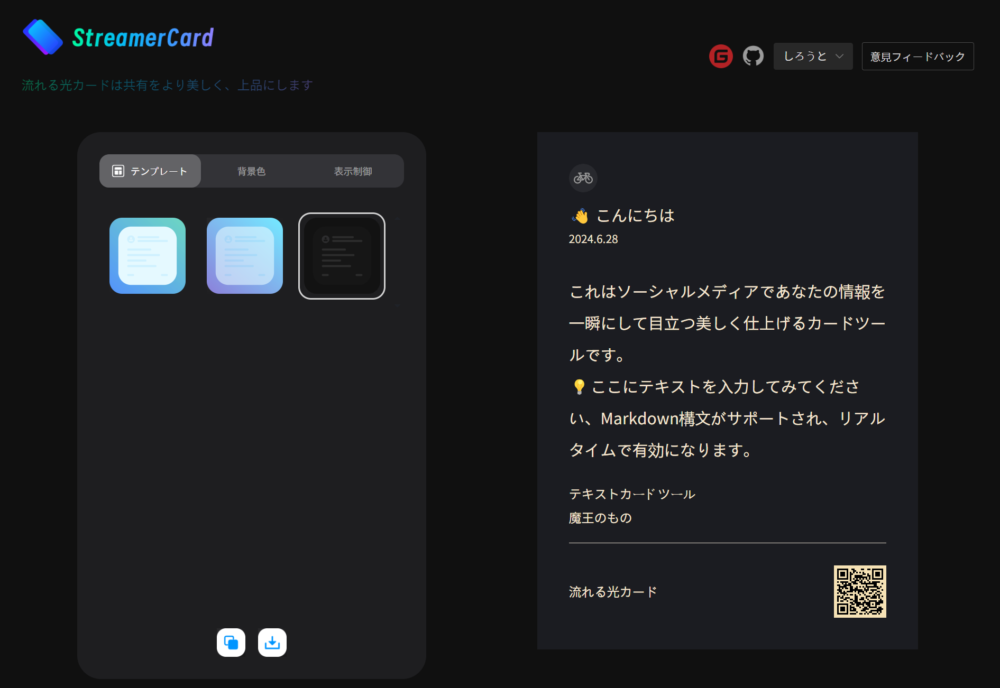
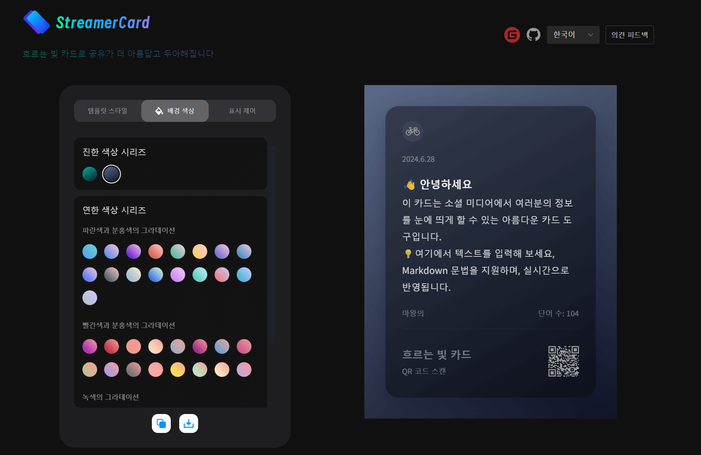

<div align="center">
<a href="https://fastgpt.in/"></a>

# Streamer Card API

By using the Flowing Light Card API, you can generate exquisite cards and integrate them into your program or business processes, such as batch generating exquisite card marketing content, etc.

<p align="center">
  <a href="./README_en.md">English</a> |
  <a href="./README.md">简体中文</a>
</p>


## ☺️ Video Tutorial

The .video files listed in the directory are demonstrations.

<a href='./tudemo_video.mp4' >Tutorial Demonstration</a>


## 🛸 Online Usage

- International Version: https://www.streamertextcard.com/en
- Domestic Version: https://fireflycard.shushiai.com/zh

|  |  |
| ------------------------------------------------------------ | ------------------------------------------------------------ |
|  |  |


## 👨‍💻 Usage

### Project Technology Stack

- Node + Express + Puppeteer

**Note:** The Node version must be greater than 18.

### Usage Instructions

```
# Install dependencies:
yarn install

# Run an example:
node example1.js
```

### API Description: POST /saveImg

#### Parameter Description

| Field Name     | Type   | Description                             |
| -------------- | ------ | --------------------------------------- |
| `temp`         | String | Template selection: tempA, tempB, tempC |
| `color`        | String | Color, see color configuration below    |
| `icon`         | String | Icon                                    |
| `title`        | String | Card title                              |
| `date`         | String | Date display                            |
| `content`      | String | Card content                            |
| `foreword`     | String | Foreword                                |
| `author`       | String | Author                                  |
| `qrcodetitle`  | String | QR code title                           |
| `qrcodetext`   | String | QR code description                     |
| `qrcode`       | String | Your QR code link                       |
| `watermark`    | String | Watermark                               |
| `switchConfig` | Object | Display control                         |

#### switchConfig Parameter Description

| Field Name      | Type    | Description     |
| --------------- | ------- | --------------- |
| `showIcon`      | Boolean | Show icon       |
| `showDate`      | Boolean | Show date       |
| `showTitle`     | Boolean | Show title      |
| `showContent`   | Boolean | Show content    |
| `showAuthor`    | Boolean | Show author     |
| `showTextCount` | Boolean | Show text count |
| `showQRCode`    | Boolean | Show QR code    |
| `showForeword`  | Boolean | Show foreword   |

#### color Parameter Description

```js
[
    "dark-color-1",
    "dark-color-2",
    "light-blue-color-1",
    "light-blue-color-2",
    "light-blue-color-3",
    "light-blue-color-4",
    "light-blue-color-5",
    "light-blue-color-6",
    "light-blue-color-7",
    "light-blue-color-8",
    "light-blue-color-9",
    "light-blue-color-10",
    "light-blue-color-11",
    "light-blue-color-12",
    "light-blue-color-13",
    "light-blue-color-14",
    "light-blue-color-15",
    "light-blue-color-16",
    "light-red-color-1",
    "light-red-color-2",
    "light-red-color-3",
    "light-red-color-4",
    "light-red-color-5",
    "light-red-color-6",
    "light-red-color-7",
    "light-red-color-8",
    "light-red-color-9",
    "light-red-color-10",
    "light-red-color-11",
    "light-red-color-12",
    "light-red-color-13",
    "light-red-color-14",
    "light-red-color-15",
    "light-red-color-16",
    "light-green-color-1",
    "light-green-color-2",
    "light-green-color-3",
    "light-green-color-4",
    "light-green-color-5",
    "light-green-color-6",
    "light-green-color-7",
    "light-green-color-8",
    "light-green-color-9",
    "light-green-color-10",
    "light-green-color-11",
    "light-green-color-12",
    "light-green-color-13",
    "light-green-color-14",
    "light-green-color-15"
]
```

### Request Example

```JSON
{
    "temp": "tempB",
    "color": "dark-color-2",
    "icon": "https://img0.baidu.com/... (icon URL)",
    "title": "👋 hi hello",
    "date": "2024/6/24 14:41",
    "content": "This is a beautiful card tool that can make your information stand out on social media in an instant. 💡 You can try typing text here, **supports Markdown syntax**, and it takes effect in real time.",
    "foreword": "Text Card Tool",
    "author": "It's the Demon King's",
    "textcount": "Word Count",
    "qrcodetitle": "Flowing Light Card",
    "qrcodetext": "Scan QR Code",
    "qrcode": "https://fireflycard.shushiai.com/",
    "watermark": "Firefly Card",
    "switchConfig": {
        "showIcon": "false",
        "showForeword": "false"
    }
}
```

### Response Example

The response will be a binary image directly.


## If you are interested in us：

Twitter：@huangzh65903362

Jike：https://web.okjike.com/u/ec41d7d5-407d-4395-ac8a-bd0f04fb202c
